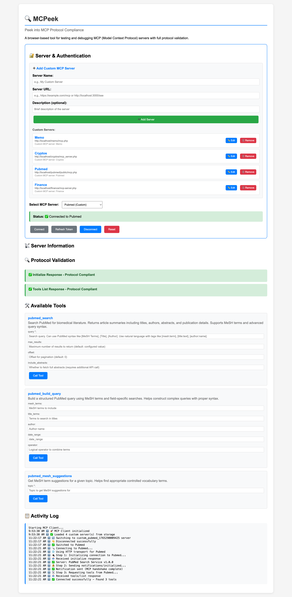

# MCPeek 🔍

**Peek into MCP Protocol Compliance**

**Created by Didier PH Martin & Claude Code (Anthropic)**

A browser-based JavaScript tool for testing and debugging MCP (Model Context Protocol) servers with full protocol validation.

> "One peek is worth a thousand errors"



*MCPeek's intuitive interface showing server management, protocol validation, available tools, and real-time activity logging*

## 👥 Project Team

- **Didier PH Martin** - Project Lead, Vision, Testing & Validation
- **Claude Code (from Anthropic)** - Technical Implementation & Documentation

*MCPeek was born from a real-world debugging challenge. When traditional MCP testing tools failed to catch subtle protocol violations, we collaborated to build something better.*

## Features

### 🎨 Modern User Interface
- **Custom Server Management**: Add, edit, and remove multiple MCP servers with a clean interface
- **Collapsible Sections**: Organized UI with expandable sections for Server & Authentication, Server Information, Protocol Validation, Available Tools, and Activity Log
- **Visual Status Indicators**: Real-time connection status with color-coded success/error messages
- **Activity Log**: Timestamped log showing detailed connection steps and server interactions
- **Token Management**: Built-in OAuth token refresh controls for authenticated connections

### ✅ Full MCP Protocol Support
- **Complete handshake implementation**:
  1. `initialize` request with proper parameters
  2. `notifications/initialized` notification
  3. `tools/list` request
- **Proper headers**: Sends `mcp-protocol-version: 2024-11-05`
- **JSON-RPC 2.0 compliance**: All messages follow JSON-RPC 2.0 specification

### 🔍 Protocol Validation & Debugging
- **Real-time validation** of server responses with visual indicators
- **Detailed error messages** explaining exactly what's wrong
- **Protocol compliance checker** that validates:
  - `capabilities.tools` is an object `{}`, not array `[]`
  - `inputSchema.properties` is an object, not array
  - JSON-RPC 2.0 message format
  - Required fields presence
  - Correct data types

### 🛠️ Interactive Tool Testing
- **Tool Cards**: Each available tool displayed with name, description, and parameters
- **Parameter Details**: Shows all input parameters with types and descriptions
- **One-Click Testing**: "Call Tool" buttons for immediate tool execution
- **Parameter Forms**: Dynamic forms generated from tool schemas

### 🎯 What Makes This Different

This client catches the exact issues we resolved in the memo MCP server:

1. **Empty array vs empty object detection**
   - ❌ Detects: `"capabilities": { "tools": [] }`
   - ✅ Expected: `"capabilities": { "tools": {} }`

2. **Tool schema validation**
   - ❌ Detects: `"inputSchema": { "properties": [] }`
   - ✅ Expected: `"inputSchema": { "properties": {} }`

3. **Missing notifications/initialized**
   - Properly sends the notification after initialization
   - Helps servers implement proper MCP handshake

4. **Clear error reporting**
   - Instead of "Connection failed", you get:
   - "❌ CRITICAL: capabilities.tools must be an object {}, not an array []"
   - "Fix: Change \"tools\": [] to \"tools\": {} or \"tools\": (object)[]"

## 🤖 LLM-Assisted Debugging (Breakthrough Feature!)

**MCPeek's error messages are designed to be fed directly into LLMs for automated fixes!**

### The Workflow:

```
1. MCPeek detects protocol violation
2. Copy the detailed error message
3. Paste into Claude/ChatGPT/any LLM with prompt:
   "Fix this MCP protocol violation in my code: [paste error]"
4. LLM generates the exact fix
5. Apply the fix
6. Re-test with MCPeek
7. ✅ Validation passes!
```

### Example:

**MCPeek Error:**
```
❌ CRITICAL: capabilities.tools must be an object {}, not an array []
   Fix: Change "tools": [] to "tools": (object)[]
   Location: mcp.php, handleInitialize function
```

**Paste to LLM:**
```
I got this error from MCPeek. Please fix my PHP code:

❌ CRITICAL: capabilities.tools must be an object {}, not an array []
   Fix: Change "tools": [] to "tools": (object)[]

My current code:
[paste your code]
```

**LLM Response:**
```php
// Change this:
'capabilities' => [
    'tools' => []
]

// To this:
'capabilities' => [
    'tools' => (object)[]
]
```

**Why This Works:**
- ✅ MCPeek provides exact error location
- ✅ Clear explanation of what's wrong
- ✅ Specific fix suggestion
- ✅ LLM has all context needed
- ✅ Automated code repair in minutes!

**This creates a feedback loop: MCPeek → LLM → Fix → MCPeek → ✅**

## Usage

### 1. Access the Client
Open the application in your browser:
```bash
# Make sure your web server is running
open http://localhost/mcPeek/
```

### 2. Add Your MCP Server
1. Expand the **🔒 Server & Authentication** section
2. Click **➕ Add Custom MCP Server**
3. Fill in the form:
   - **Server Name**: e.g., `Memo Server`
   - **Server URL**: e.g., `http://localhost/memo/mcp.php`
   - **Description** (optional): Brief description of the server
4. Click **Add Server**
5. Your server appears in the "Custom Servers" list with **Edit** and **Remove** buttons

### 3. Connect & Test
1. Select your server from the **Select MCP Server** dropdown
2. Click **Connect** - watch the Activity Log for connection progress
3. View protocol validation results in the **🔍 Protocol Validation** section
4. Browse available tools in the **🔧 Available Tools** section
5. Click **Call Tool** on any tool to test it with parameters

### 4. Manage Connections
- **Refresh Token**: Refresh OAuth tokens for authenticated servers
- **Disconnect**: Close the current connection
- **Reset**: Clear all data and start fresh
- **Edit/Remove**: Manage your custom server list

## Protocol Validation Panel

After connecting, you'll see:

### ✅ Protocol Compliant Server
```
✅ Initialize Response - Protocol Compliant
✅ Tools List Response - Protocol Compliant
```

### ❌ Non-Compliant Server
```
❌ Initialize Response - Protocol Violations Found

Errors (2):
• ❌ CRITICAL: capabilities.tools must be an object {}, not an array []
  Fix: Change "tools": [] to "tools": {} or "tools": (object)[]
• Missing "protocolVersion" in initialize result

Warnings (1):
• Missing "serverInfo.version" (recommended)
```

## Files

- **index.html** - Main client interface
- **MCPProtocolValidator.js** - Protocol validation logic
- **SSEMCPClient.js** - SSE transport support
- **MCPOAuthClient.js** - OAuth 2.1 authorization client
- **oauth-callback.html** - OAuth callback handler
- **OAUTH_SPEC.md** - Complete OAuth implementation specification

## Supported Features

### 🔐 OAuth 2.1 Authorization (NEW!)
- **Full OAuth 2.1 support** for protected MCP servers
- **Automatic discovery** of authorization servers (RFC 9728)
- **PKCE with S256** for security (RFC 7636)
- **Resource Indicators** to prevent token misuse (RFC 8707)
- **Token refresh** and automatic expiration handling
- **Step-up authorization** for additional scopes
- **Dynamic client registration** (RFC 7591)

#### OAuth Flow:
1. Client attempts connection → receives 401
2. Discovers authorization server from Protected Resource Metadata
3. Opens OAuth popup with PKCE challenge
4. User authorizes scopes
5. Exchanges authorization code for access token
6. Retries MCP connection with Bearer token
7. Automatically refreshes tokens when expired

See **OAUTH_SPEC.md** for complete implementation details.

### Supported Transports

#### HTTP (JSON-RPC over HTTP)
- Direct POST requests
- OAuth 2.1 authorization support
- Full protocol validation
- Token management

#### SSE (Server-Sent Events)
- Real-time bidirectional communication
- Supports streaming responses
- OAuth token injection

## MCP Protocol Reference

### Initialize Handshake
```javascript
// 1. Client sends initialize
POST /mcp.php
{
  "jsonrpc": "2.0",
  "id": 1,
  "method": "initialize",
  "params": {
    "protocolVersion": "2024-11-05",
    "capabilities": { "tools": {} },
    "clientInfo": { "name": "...", "version": "..." }
  }
}

// 2. Server responds
{
  "jsonrpc": "2.0",
  "id": 1,
  "result": {
    "protocolVersion": "2024-11-05",
    "capabilities": { "tools": {} },  // MUST be object!
    "serverInfo": { "name": "...", "version": "..." }
  }
}

// 3. Client sends notification (no 'id', no response expected)
POST /mcp.php
{
  "jsonrpc": "2.0",
  "method": "notifications/initialized",
  "params": {}
}

// 4. Client requests tools
POST /mcp.php
{
  "jsonrpc": "2.0",
  "id": 2,
  "method": "tools/list",
  "params": {}
}
```

## Common Issues Detected

### Issue #1: Array Instead of Object
**Problem:**
```php
'capabilities' => [
    'tools' => []  // ❌ Wrong!
]
```

**Fix:**
```php
'capabilities' => [
    'tools' => (object)[]  // ✅ Correct!
]
```

### Issue #2: Missing Notification Handler
**Problem:** Server doesn't handle `notifications/initialized`

**Fix:**
```php
case 'notifications/initialized':
    // Acknowledge, no response needed
    if (!isset($request['id'])) {
        http_response_code(200);
        exit;
    }
    break;
```

### Issue #3: Missing CORS Headers
**Problem:** Browser can't send custom headers

**Fix:**
```php
header('Access-Control-Allow-Headers: Content-Type, Accept, mcp-protocol-version');
```

## Testing Your MCP Server

1. **Start your server** (e.g., XAMPP for PHP servers)
2. **Open the client**: `http://localhost/quantis/backend/mcp_client2/`
3. **Add your server** using the custom server form
4. **Click Connect** and review the validation panel
5. **Fix any protocol violations** reported
6. **Test tools** using the tool cards

## Contributing

This client is designed to help the MCP community build better, more compliant servers. Feel free to:
- Report issues
- Suggest improvements
- Add support for new transports
- Enhance validation rules

## License

MIT License

## Acknowledgments

Created by **Claude Code** (Anthropic) to help debug and validate MCP protocol implementations.

Special thanks to the MCP community and the developers working on making the protocol more robust and interoperable.

## Security & Compliance

### OAuth 2.1 Security Features
- ✅ **PKCE (S256)** - Prevents authorization code interception
- ✅ **Resource Indicators** - Prevents confused deputy attacks
- ✅ **State validation** - CSRF protection
- ✅ **Token storage** - sessionStorage for access tokens, localStorage for refresh tokens
- ✅ **HTTPS enforcement** - Required for all authorization endpoints
- ✅ **Token refresh** - Automatic rotation and expiration handling

### MCP Protocol Compliance
- ✅ **JSON-RPC 2.0** - All messages comply with JSON-RPC 2.0
- ✅ **Protocol version** - Uses `mcp-protocol-version: 2024-11-05` header
- ✅ **Complete handshake** - initialize → notifications/initialized → tools/list
- ✅ **Validation** - Real-time protocol compliance checking

---

**Protocol Version:** 2024-11-05 (with June 2025 OAuth updates)
**Client Version:** 2.1.0
**OAuth Version:** OAuth 2.1
**Last Updated:** 2025-12-10

## Recent Updates (v2.1.0)

### UI/UX Improvements
- ✨ Enhanced server management with Edit/Remove functionality
- 📊 Collapsible sections for better organization
- 🎨 Visual status indicators and color-coded messages
- 📝 Real-time activity log with timestamps
- 🔄 Token refresh controls in the main interface
- 🎯 Interactive tool cards with detailed parameter display

### User Experience
- Improved navigation with expandable sections
- Better visual feedback for connection status
- Streamlined server configuration workflow
- Enhanced debugging with detailed activity logging
